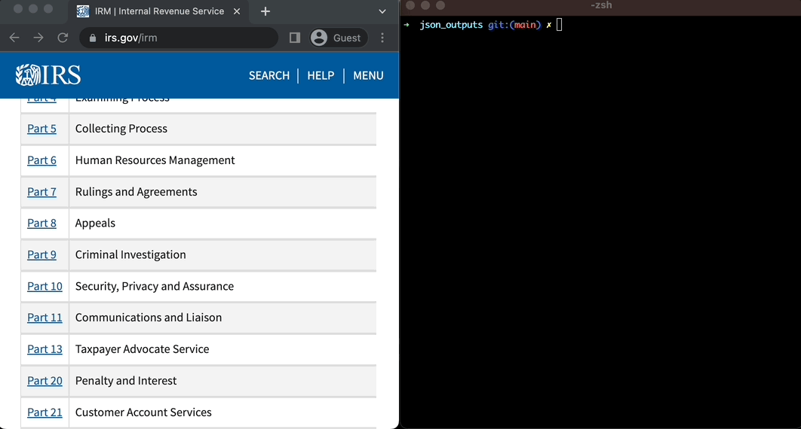

## Chat with IRS Manuals

This directory contains an application for chatting with IRS manuals. Once data is available, the chat application only uses self-hosted models and can be run in a disconnected environment. Here's how to get started with the chatbot:

### Installation

```bash
pip install requirements.txt
```

### Environment Variables

**Note there are other options for these connections, but these are the ones referenced in this implementation**

[OpenAI](https://platform.openai.com/docs/api-reference)

[Pinecone](https://docs.pinecone.io/)

```python
PINECONE_API_KEY
PINECONE_API_ENV
OPENAI_API_KEY
PINECONE_INDEX_NAME
```

### Download PDFs from IRS website

```bash
python download_data.py <Base URL> <Page Start> <Page End> <Target Directory>
```


### Run PDFs against unstructured-ingest

```bash
PYTHONPATH=. ./unstructured/ingest/main.py \
  --local-input-path <ingest-input-dir> \
  --structured-output-dir <ingest-output-dir> \
  # optional parameter -> this will hit the *NEW* API vs. processing locally
  --partition-by-api
  ```


Here's an example of the structured json output




### Seed and utilize vector db

```bash
python ingest_data.py <path-to-structured-json-file-directory>
```

### Run the chat CLI

```bash
python cli_app.py
```


### Chat with our hosted instance [here](https://huggingface.co/spaces/unstructuredio/irs-manuals)

